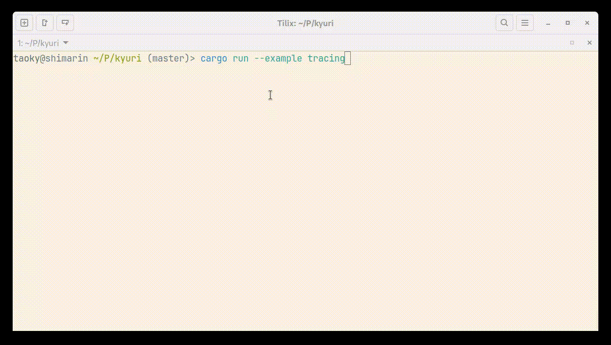

# kyuri

A progress display library specifically designed for my mirroring softwares ([tsumugu](https://github.com/taoky/tsumugu) & [yukina](https://github.com/taoky/yukina)).

Uses some code from [indicatif](https://github.com/console-rs/indicatif) (MIT).

Docs: [docs.rs/kyuri](https://docs.rs/kyuri)

The API is not stable yet.

## Why?

It could output a progress indicator both when printing to terminal and (especially when) writing to file, with minimal distraction.

And no other dependencies.

If you need a progress bar or spinner with rich and fancy features, use [indicatif](https://github.com/console-rs/indicatif) instead.

## Examples

- [Simple example](examples/progress.rs)

    

    ```shell
    cargo run --example progress
    cargo run --example progress > file
    ```

- 2 threads example ([thread](examples/thread.rs), [download](examples/download.rs))

    

    ```shell
    cargo run --example thread
    cargo run --example thread > file
    ```

    or this with a different pattern:

    

    ```shell
    cargo run --example download
    cargo run --example download > file
    ```

- Progress bar example

    

    ```shell
    cargo run --example bar
    cargo run --example bar > file
    ```

- `tracing` integration example

    

    ```shell
    cargo run --example tracing
    cargo run --example tracing > file
    ```

---


(Taken from *[BanG Dream! It's MyGO!!!!!](https://en.wikipedia.org/wiki/MyGO!!!!!)* episode 6.)
